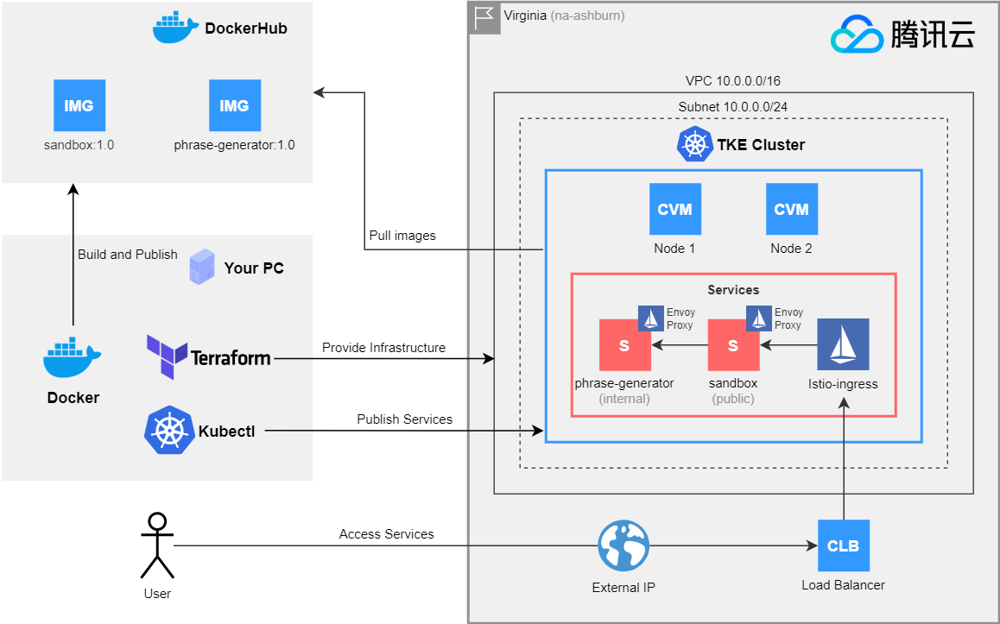
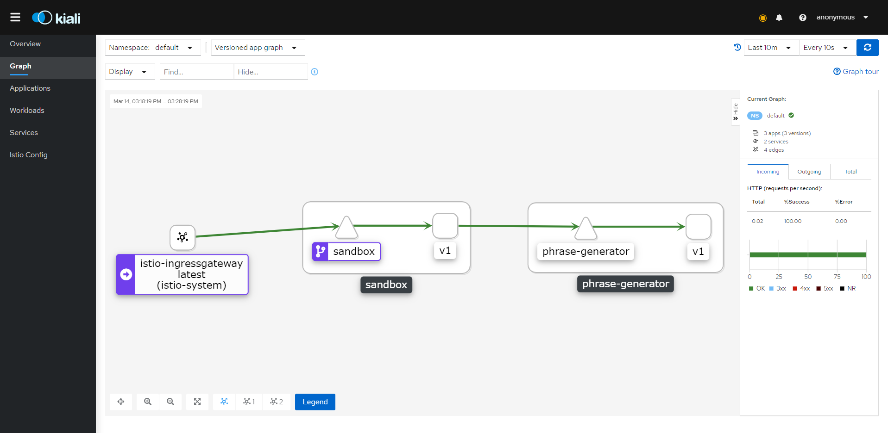

English | [中文](README.zh-CN.MD)

# Tencent Cloud TKE - 🍱 Sandbox

[]()
[]()

My Sandbox repository for Tencent Cloud Kubernetes stuff

[](assets/diagram.png)

## 🔌 Requirements
The **Go language** is required for building and running the project modules, the **Terraform** is only about providing
the cloud structure we need.

- Docker
- Docker-Compose (with support to version 3 yml files)
- Go 1.16
- Terraform 0.14+
- [Istioctl](https://istio.io/latest/docs/setup/getting-started/)

## 🔰 Getting Started

First thing you need to do is to get you local environment ready with the dependencies I described above. Then
You need to have a Tencent Cloud account ready and create an API Key. Having that in hands just follow the next topics.

## ⚙️Let's wrap those API Keys

Just export these or set them in you bash_profile, Windows environment or whatever.

```shell
EXPORT TENCENTCLOUD_REGION=na-ashburn
EXPORT TENCENTCLOUD_SECRET_ID=your_secret_id
EXPORT TENCENTCLOUD_SECRET_KEY=your_secret_key
```

Depending on the way you set those, make sure to restart your terminal so changes can take effect. 

> 📢 **Hey!** na-ashburn is basically Virginia region for Tencent Cloud

## 🧱 Providing the TKE cluster environment

First check the **Terraform** files in `infrastructure/tencentcloud` for providing the **TKE cluster** for this project.
You can customize the cluster if you want, but rest assured because we will be providing very small machines,
so these are not going to devour your wallet.

Let's start initializing terraform for this project:

```shell
cd infrastructure/tencentcloud
terraform init
```

Basically **Terraform** will download the provider templates files and get ready to *plan* and *apply* the cloud structure.

We can check our plan by executing:

```shell
terraform plan
```

If you are following this guide and executing the commands you can check that terraform inform you that it is going to
create 3 resources. So what are those 3 resources?

- VPC (10.0.0.0/16)
- VPC Subnet (10.0.0.0/24)
- TKE Cluster

> 📢 **Hey!** The cluster will be open to the world `0.0.0.0/0` you can change that configuration if you are concerned
> by changing the `managed_cluster_internet_security_policies` variable in `infrastructure/tencencloud/variables.tf`.

All right, now let's apply this plan by executing:

```shell
terraform apply
```

**Terraform** will show you the plan again and ask you to confirm by inputting `yes`, so just confirm that and let
**Terraform** provide the cloud structure for us. When **Terraform** returns the terminal for you, you are set!

> 📢 **Hey!** Tencent Cloud takes up to 3 minutes to create a TKE cluster. It's time to take that cup of coffee ☕

## 🛠️ Configure the Kubectl context

The **TKE Cluster** is now running, so access https://console.cloud.tencent.com/tke2/cluster and learn how to configure your
kubectl context in the **Basic Information** page, so you can start working with the cluster we created.

You can check your configuration by executing:

```shell
kubectl get all
```

If it returns a `service/kubernetes` and some other information, you are set.

## 🕸️ Deploying Istio Service Mesh

We are using **Istio** service mesh for this project, so by using `istioctl` we can install and configure *Istio* very easily.

```shell
istioctl install --set profile=demo -y
```

Add a namespace label to instruct **Istio** to automatically inject **Envoy** sidecar proxies when we deploy our application late.

```shell
kubectl label namespace default istio-injection=enabled
```

**Tencent Cloud** will automatically create a Load Balancer for **Istio** You can check the external ip from it by executing:

```shell
kubectl get service/istio-ingressgateway -n istio-system
```

The `EXTERNAL-IP` from the `service/istio-ingressgateway` is your Load Balancer external ip, and the one that will publish your stuff.  
Because there is not **Virtual Service** deployed, nothing will be published there yet.

## 🚀 Deploying the Services

Deploying the services is a simple task, we just need to build, publish and apply the services manifests, and we are done.
There are two ways to do it, you can use my already built images from my **Docker Hub** or build the images your self and
publish them.

If your terminal is in the `infrastructure/tencentcloud` folder, go back to the project's root folder:

```shell
cd -
```

If you want to use my **Docker Hub** public images just apply those manifests:

```shell
kubectl apply -f infrastructure/module/sandbox
kubectl apply -f infrastructure/module/phrase-generator
```

Or if you want to build them (Also make sure you are logged into your Docker Hub account):

```shell
docker build module/sanbox -t YOUR_DOCKERHUB_USER/sandbox:1.0
docker build module/phrase-generator -t YOUR_DOCKERHUB_USER/phrase-generator:1.0

docker push YOUR_DOCKERHUB_USER/sandbox:1.0
docker push YOUR_DOCKERHUB_USER/phrase-generator:1.0

kubectl apply -f infrastructure/module/sandbox
kubectl apply -f infrastructure/module/phrase-generator
```

> 📢 **Hey!** Because the Kubernetes manifest files are using my **Docker Hub**, if you choose to build them yourself
> you need to update those files in `infrastructure/modules/*` to point to your **Docker Hub** otherwise you will be
> using my images.

## 🌐 Deploying the Gateway and Virtual Service

Finally, we need to deploy the **Gateway** and the **Virtual Service**, here is where we set our mappings for each service and their
URLs, because we are just exposing the `sandbox` module and the `phrase-generator` is internal only, it is not included  there. 

```shell
kubectl apply -f infrastructure/module/network
```

## 🏁 Done! Let's check if it's working

If not already, check your external ip by executing:

```shell
kubectl get service/istio-ingressgateway -n istio-system
```

Let's check if your setup is working by executing:

```shell
curl EXTERNAL-IP/phrase -v
```

If your response was http status 200 and one of those `Hello World!`,`こんにちは世界！`,`世界你好！`,`Olá Mundo!` you are set.

## 🔍 Monitoring stuff

Istio include Kiali, Prometheus, Grafana and Jaeger addons, you can install them by executing:

```shell
kubectl apply -f istio/samples/addons
```

It is normal to receive errors about `no matches for kind "MonitoringDashboard"` just apply the manifests again.

Let's start with Kiali:

```shell
istioctl dashboard kiali
```

[]()

Then you can also explore Grafana, Istio already have some setup dashboards:

```shell
istioctl dashboard grafana
```

## 🗑️ Cleanning up the infrastructure

Don't worry about your wallet 💰, because we are using `Terraform` cleaning up this infrastructure is very simple, just execute the following commands:

```shell
cd infrastructure/tencentcloud
terraform destroy
```

Just confirm that you want to destroy it and you are done.