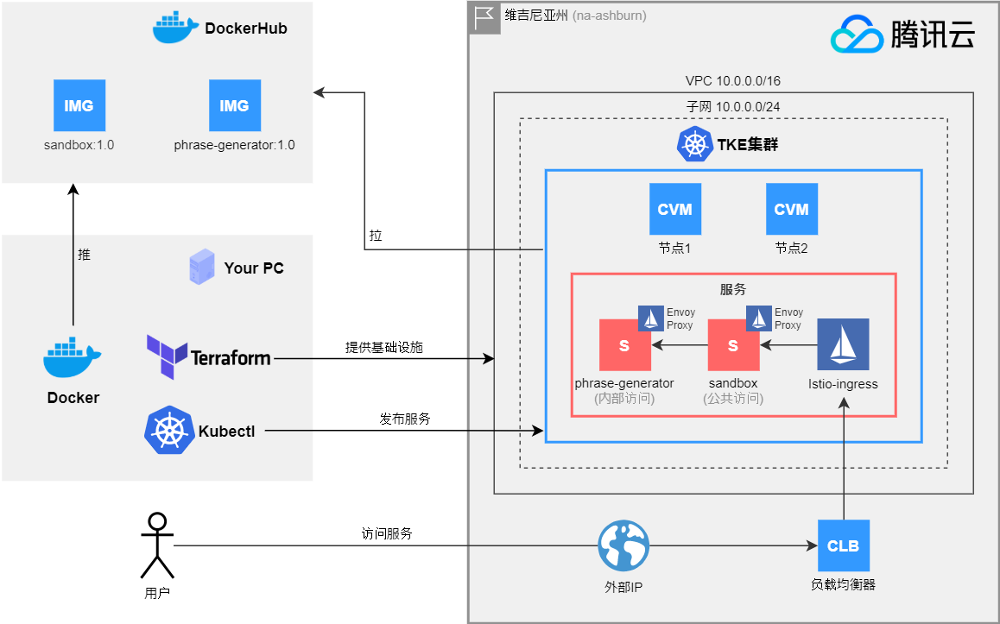

[English](README.md) | 简体中文

谷歌翻译 (Google Translated)

# 带有Istio Service Mesh的腾讯云TKE

[]()
[]()

将腾讯云Kubernetes与Istio Service Mesh结合使用。

[](assets/infra.zn-CN.png)

## 🔌要求
**Go语言**是构建和运行项目模块所必需的，**Terraform**仅用于提供
我们需要的云结构。

- Docker
- Docker-Compose (with support to version 3 yml files)
- Go 1.16
- Terraform 0.14+
- [Istioctl](https://istio.io/latest/docs/setup/getting-started/)

## 🔰入门

您需要做的第一件事是为本地环境准备好我上面描述的依赖项。然后
您需要准备好一个腾讯云帐户并创建一个API密钥。掌握这些内容之后，请关注下一个主题即可。

## ⚙️让我们包装这些API密钥

只需导出这些文件或在您的bash_profile，Windows环境或其他环境中进行设置即可。

```shell
EXPORT TENCENTCLOUD_REGION=na-ashburn
EXPORT TENCENTCLOUD_SECRET_ID=your_secret_id
EXPORT TENCENTCLOUD_SECRET_KEY=your_secret_key
```

根据您的设置方式，请确保重新启动终端，以使更改生效。

>📢嘿！**na-ashburn**基本上是腾讯云的弗吉尼亚州地区

## 🧱提供TKE集群环境

首先，检查`infrastructure/tencentcloud`中的**Terraform**文件，以提供该项目的“ TKE集群”。
您可以根据需要自定义集群，但是请放心，因为我们将提供非常小的计算机，
因此这些不会吞噬您的钱包。

让我们开始为该项目初始化terraform：

```shell
cd infrastructure/tencentcloud
terraform init
```

基本上，**Terraform**将下载提供程序模板文件，并准备**plan**和**apply**云结构。

我们可以通过执行以下操作来检查我们的计划：

```shell
terraform plan
```

如果您遵循本指南并执行命令，则可以检查terraform是否会通知您
创建3个资源。那么这3种资源是什么？

- VPC（10.0.0.0/16）
- VPC子网（10.0.0.0/24）
- TKE集群

>📢 嘿！群集将向世界开放'0.0.0.0/0'，如果您担心的话可以更改该配置
>通过更改“ infrastructure / tencencloud / variables.tf”中的“ managed_cluster_internet_security_policies”变量。

好的，现在让我们通过执行以下方案来应用此计划：

```shell
terraform apply
```

**Terraform**会再次向您显示计划，并要求您输入“是”进行确认，因此只需确认并让
**Terraform**为我们提供了云结构。当**Terraform**为您返回终端时，您就设置好了！

>📢嘿！腾讯云最多需要3分钟来创建一个TKE集群。是时候喝杯咖啡了☕

## 🛠️配置Kubectl上下文

**TKE集群**现在正在运行，因此请访问 https://console.cloud.tencent.com/tke2/cluster 并了解如何配置您的
“基本信息”页面中的kubectl上下文，因此您可以开始使用我们创建的集群。

您可以通过执行以下命令检查配置：

```shell
kubectl get all
```

如果它返回`service / kubernetes`和一些其他信息，则设置成功。

## 🕸️部署Istio服务网格

我们正在为该项目使用**Istio**服务网格，因此通过使用`istioctl`，我们可以非常轻松地安装和配置**Istio**。

```shell
istioctl install --set profile=demo -y
```

添加一个名称空间标签，以指示**Istio**在我们后期部署应用程序时自动注入**Envoy** sidecar代理。

```shell
kubectl label namespace default istio-injection=enabled
```

**腾讯云**将自动为**Istio**创建负载均衡器。您可以通过执行以下操作从中检查外部IP：

```shell
kubectl get service/istio-ingressgateway -n istio-system
```

`service/istio-ingressgateway`中的EXTERNAL-IP是您的负载均衡器外部ip，它是将发布您的内容的IP。
由于尚未部署“虚拟服务”，因此目前尚未发布任何内容。

## 🚀部署服务

部署服务是一个简单的任务，我们只需要构建，发布和应用服务清单，就可以了。
有两种方法可以执行此操作，您可以使用Docker Hub**中已构建的映像，也可以自行构建映像，然后
发布它们。

如果您的终端位于`infrastructure/tencentcloud`文件夹中，请返回项目的根文件夹：

```shell
cd -
```

如果您想使用我的**Docker Hub**公共映像，只需应用以下清单即可：

```shell
kubectl apply -f infrastructure/module/sandbox
kubectl apply -f infrastructure/module/phrase-generator
```

或者，如果您要构建它们（还请确保您已登录Docker Hub帐户）：

```shell
docker build module/sanbox -t YOUR_DOCKERHUB_USER/sandbox:1.0
docker build module/phrase-generator -t YOUR_DOCKERHUB_USER/phrase-generator:1.0

docker push YOUR_DOCKERHUB_USER/sandbox:1.0
docker push YOUR_DOCKERHUB_USER/phrase-generator:1.0

kubectl apply -f infrastructure/module/sandbox
kubectl apply -f infrastructure/module/phrase-generator
```

>📢嘿！因为Kubernetes清单文件正在使用我的**Docker Hub**，所以如果您选择自己构建它们的话
>您需要在`infrastructure/modules/*`中更新这些文件以指向您的**Docker Hub**，否则您将
>使用我的图像。

## 🌐部署网关和虚拟服务

最后，我们需要部署**Gateway**和**Virtual Service**，在这里我们为每个服务及其映射设置映射
网址，因为我们只是公开`sandbox`模块，而`phrase-generator`只是内部的，所以不包含在其中。

```shell
kubectl apply -f基础架构/模块/网络
```

## 🏁完成！让我们检查一下是否正常

如果尚未执行以下操作，请检查您的外部IP：

```shell
kubectl获取服务/ istio-ingressgateway -n istio-system
```

让我们通过执行以下命令来检查您的设置是否正常运行：

```shell
curl EXTERNAL-IP/phrase -v
```

如果您的响应是http状态200，并且是` Hello World!`，`こんにちは世界！`，`世界你好！`，`Olá Mundo!`之一，那么您已设置好。

## 🔍监控内容

Istio包括Kiali，Prometheus，Grafana和Jaeger插件，您可以通过执行以下命令进行安装：

```shell
kubectl apply -f istio/samples/addons
```

收到有关"MonitoringDashboard"种类不匹配的错误是正常的，只需再次应用清单即可。

让我们从Kiali开始：

```shell
istioctl dashboard kiali
```

[]()

然后，您还可以探索Grafana，Istio已经有了一些设置仪表板：

```shell
istioctl dashboard grafana
```

## 🗑️清理基础架构

不用担心您的钱包💰，因为我们正在使用“ Terraform”清理此基础架构非常简单，只需执行以下命令：

```shell
cd infrastructure/tencentcloud
terraform destroy
```

只需确认您要销毁它就可以了。
